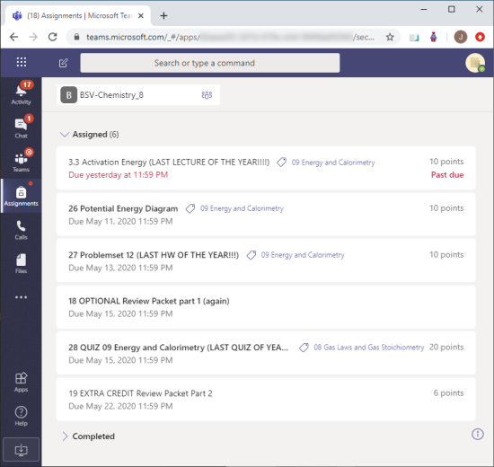
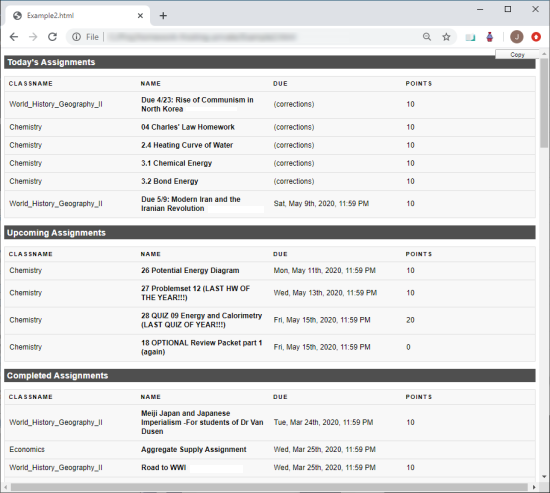

# homework-frosting

Keep track of your class assignments with `homework-frosting` Chrome extension~~

Available on [Chrome Web Store](https://chrome.google.com/webstore/detail/homework-frosting/xxxxxx).

Microsoft Teams makes assignments very hard to find. You have to click through to each class,
then you have to click "load more" possibly multiple times on each page. You have to manually
look through the Completed section in case teachers have returned anything to you for corrections.
I've found it takes ten or more minutes to go through all of these pages.

Enter Homework Frosting. It can do all of this in about five seconds and instantly generate a report!
You can copy this report to Google Docs or Google Sheets with copy-and-paste.

# Examples

## Organized page of assignments that were found

To this, with everything on one page:

# Credits

Icons made by <a href="https://www.flaticon.com/authors/prosymbols" title="Prosymbols">Prosymbols</a> from <a href="https://www.flaticon.com/" title="Flaticon"> www.flaticon.com</a>
